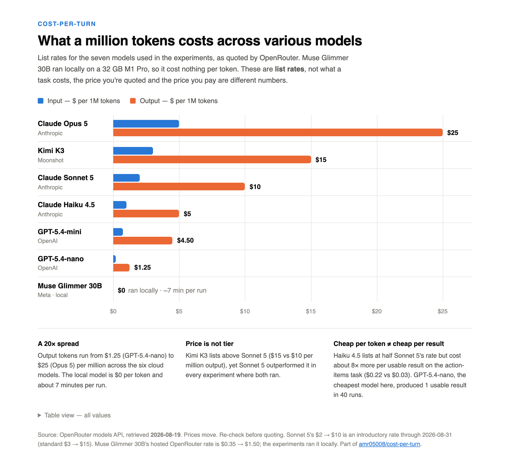

# cost-per-turn

A running public repo for one question: **what does your agent work actually
cost?**

Most people running Claude Code have no live visibility into spend, context
burn, or rate-limit consumption — you find out when you hit a wall. This repo
is where I build and host the tools that make those numbers visible, and run
the experiments that explain them.

Everything here is local-first: Python 3.10+, standard library only, nothing
leaves your machine.

## What's here

| file | what it is |
| --- | --- |
| `statusline.py` | A live cost meter for your terminal — session cost, context usage, and rate-limit bars in Claude Code's status line |
| `status-line-prompts.md` | The exact prompts used to build and customize the status line |
| `analyze-history.py` | Prices your entire Claude Code transcript history against a date-stamped price sheet — cost per turn, cache hit rate, spend by repo |
| `prices.json` | The date-stamped model price sheet `analyze-history.py` bills against |
| `tests/` | A synthetic fixture so you can run the analyzer with zero session history of your own |
| `experiments/` | The experiments themselves — fixtures, prompts, answer keys, raw outputs, results |
| `protocols/` | How each experiment is run, in enough detail to repeat it |
| `scripts/` | Extractors and graders that turn raw run logs into comparable numbers |

More experiments land here as they run. The status line is the front door;
the history analyzer is the record; `experiments/` is the evidence.

Start with [`experiments/README.md`](experiments/README.md) for what's been run and
what each task is actually testing.

## Start here: put a cost meter in your terminal

This is the tool from the video
([watch it here](https://www.youtube.com/watch?v=I2a0EJ67cVo)). Claude Code has
a built-in **status line** — it runs a command you specify, pipes it JSON
about the current session, and prints whatever your command returns at the
bottom of the terminal. `statusline.py` is a ready-made one:

```
📁 widget-shop │ ⏱ 15m 32s │ ▲ +118 -40 │ ◔ 380k/1000k ▓▓▓░░░░░ 38% │ $2.47 │ 5h ▓░░░░░░░ 22% │ 7d ▓▓▓▓░░░░ 61% │ ◆ Opus 5
```

Repo · session duration · lines changed · context used · **session cost** ·
5-hour and 7-day rate-limit bars · model. Cost turns yellow at $1 and red at
$5; context and limit bars turn yellow at 70% and red at 90%.

Install:

```bash
cp statusline.py ~/.claude/statusline.py
```

Then add this to `~/.claude/settings.json` (use the absolute path — `~` is not
expanded in the command string):

```json
{
  "statusLine": {
    "type": "command",
    "command": "python3 /Users/YOU/.claude/statusline.py"
  }
}
```

Start a new session and the line appears. Test it without Claude Code by piping
it a payload:

```bash
echo '{"workspace":{"current_dir":"/tmp/demo"},"cost":{"total_cost_usd":2.47},
"model":{"display_name":"Opus 5"}}' | python3 statusline.py
```

Don't want to copy mine? Build your own — the prompts I used are in
[`status-line-prompts.md`](status-line-prompts.md), and the
[status line docs](https://code.claude.com/docs/en/statusline) cover the JSON
payload. It's just a script; make it yours.

The minimum useful version is four lines — everything else is decoration:

```python
import json, sys, os
d = json.load(sys.stdin)
print(f"{os.path.basename(d.get('workspace',{}).get('current_dir',''))} "
      f"· ${(d.get('cost') or {}).get('total_cost_usd') or 0:.2f}")
```

**What the status line shows you is per-session, live, and gone when the
session ends.** That is exactly the gap the analyzer fills — the status line
is the gauge, the analyzer is the record.

## The analyzer: price your entire history

Claude Code has been writing per-turn token usage to disk for every session you
have ever run. `analyze-history.py` reads those transcripts, prices each turn
against `prices.json`, and gives you a baseline — cost per turn across a
session, your real cache hit rate, and spend grouped by repo.

No new instrumentation. No account linking. Nothing leaves your machine.

```bash
python3 analyze-history.py --list-repos          # see what's on disk
python3 analyze-history.py --repo my-project     # analyse just that repo
```

### What you get

```
1. COST PER TURN ACROSS A LONG SESSION  (the curve)
   turns        $/turn   ctx tokens
      1-17      0.3180       98,412   ###########.................
     ...
    186-202     0.8298      381,650   ############################

2. CACHE HIT RATE
   overall            95.85%

3. COST BY REPO
   repo                        cost  sess  turns   $/turn   cache
   ...
```

Plus two CSVs in `out/` (`sessions.csv`, one row per session; `turns.csv`, one
row per API request). Both are gitignored — the script is the artifact; your
data never is.

### The `--repo` filter is required

Not an option — a required argument. Transcripts on a working machine mix
personal projects with whatever else you have opened Claude Code in, and a
cost report is the kind of artifact that gets pasted into a blog post. Making
inclusion explicit means shipping the wrong sessions somewhere takes a
deliberate act rather than a forgotten flag.

`--list-repos` prints repo names and session counts only — no tokens, no costs,
no content — so you can choose a filter without reading anything into the CSVs.

### Prices live in `prices.json`, never in the script

Every historical cost number is only meaningful against a known price sheet, so
the sheet is a separate, date-stamped file. To reprice history against different
rates, copy it, edit it, and pass `--prices`.

Two things the sheet gets right that are easy to get wrong:

- **Cache writes have two rates, not one.** The 5-minute TTL bills at 1.25x the
  model's input rate and the 1-hour TTL at 2x. Claude Code uses both in the same
  session, so `cache_creation_input_tokens` must be split on
  `usage.cache_creation.ephemeral_{1h,5m}_input_tokens`. On real data the 1-hour
  writes alone were 31% of total spend — pricing them at the 5m rate understates
  the bill badly.
- **Model is read per message, not per session.** Sessions switch models
  mid-way, and pricing has to follow the model that actually served each turn.

If a model appears in a transcript but not in the sheet, its turns are counted,
priced at zero, and named in the output — never silently dropped.

### The one thing you must not do: sum the JSONL lines

Claude Code writes **one line per content block** of an assistant message — the
thinking block, the text block, and each `tool_use` block are separate lines —
and repeats the *identical* `message.usage` on every one of them. Summing
assistant lines therefore counts the same API response two to six times.

On one real history: 14,400 assistant lines carrying usage, but only 5,713
actual API requests. Naive summing inflated `cache_creation_input_tokens` by
**5.75x** and output tokens by **3.31x**.

`message.id` is the API response id, so it is the correct unit of billing. This
script deduplicates on it. If you write your own parser, do the same — this is
the single easiest way to produce a confidently wrong number.

Two related shapes worth knowing:

- **Subagent transcripts** live at `<project>/<session-id>/subagents/*.jsonl`
  and carry the *parent* session's id. They are real spend on that session. A
  one-level glob misses them entirely; a recursive glob that treats each file
  as its own session mis-attributes them. Here they are folded into the parent
  and flagged with `is_sidechain`.
- **`<synthetic>` model lines** are locally generated and carry an all-zero
  usage block. Priced at zero, counted separately, so turn counts stay honest.

### Running it on a clean machine

A synthetic fixture ships with the repo so you can run the whole thing without
any session history of your own:

```bash
python3 analyze-history.py --projects-dir tests/fixtures/projects \
        --repo widget-shop --repo note-taker
```

The fixture reproduces every awkward shape above on purpose — repeated usage
across content blocks, both cache TTLs in one session, a model switch mid-run, a
nested subagent transcript, a `<synthetic>` line, and non-assistant lines with
no usage at all. Regenerate it deterministically with
`python3 tests/make_fixture.py`.

### Caveats

- **Machine-scoped.** Transcripts are per-machine. Run it on each machine and
  merge on `session_id`.
- **List prices, not your bill.** If the sessions ran under a Claude
  subscription plan rather than metered API billing, these figures are
  *equivalent API cost* — the right number for comparing configurations against
  each other, not the amount anyone charged you. Say which one you mean when
  publishing.
- **Turn = one API request**, not one thing you typed. A single prompt usually
  costs several turns.

## Figures

Reference charts, kept here so they can be linked to rather than screenshotted.
Each one carries the date its numbers were pulled — prices move, and a figure
without an `as_of` is a figure you can't trust six weeks later.

### What a million tokens costs

The seven models used in the experiments, list rates as of 2026-08-19. Six are
cloud models priced off OpenRouter; Muse Glimmer 30B ran locally, so it sits at
$0 per token. Source: [`figures/model-pricing.html`](figures/model-pricing.html)
— open it for the hover values and the full table.

<picture>
  <source media="(prefers-color-scheme: dark)" srcset="figures/model-pricing-dark.png">
  
</picture>

Three things this chart is for:

- **A 20× spread in output pricing** across the six cloud models, from $1.25
  (GPT-5.4-nano) to $25 (Opus 5), plus a local model that costs nothing per
  token and about seven minutes per run.
- **Price is not tier.** Kimi K3 lists above Sonnet 5, yet Sonnet 5
  outperformed it in every experiment where both ran.
- **List rate is not what a task costs.** That's the whole point of the
  experiments below — Haiku 4.5 is half Sonnet 5's rate on paper and about 8×
  the cost per usable result on the action-items task.

## Where this is going

Step one was the baseline: make spend visible live (the status line) and
measurable after the fact (the analyzer). Next up are the experiments that
baseline makes possible — what different workflows actually cost, where the
cache earns its keep, and what changes when you switch models. Results and
tooling land in this repo as they run.
